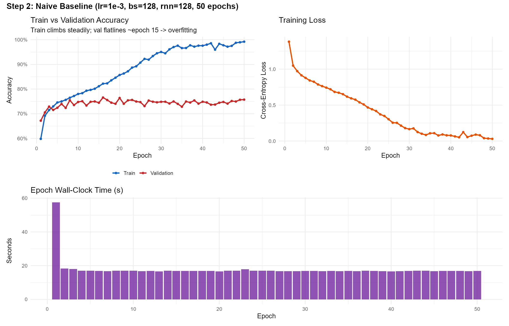
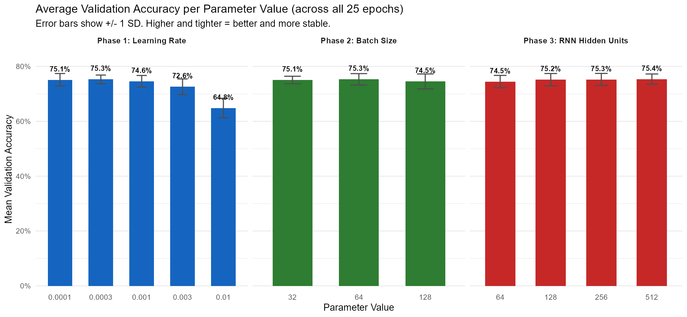
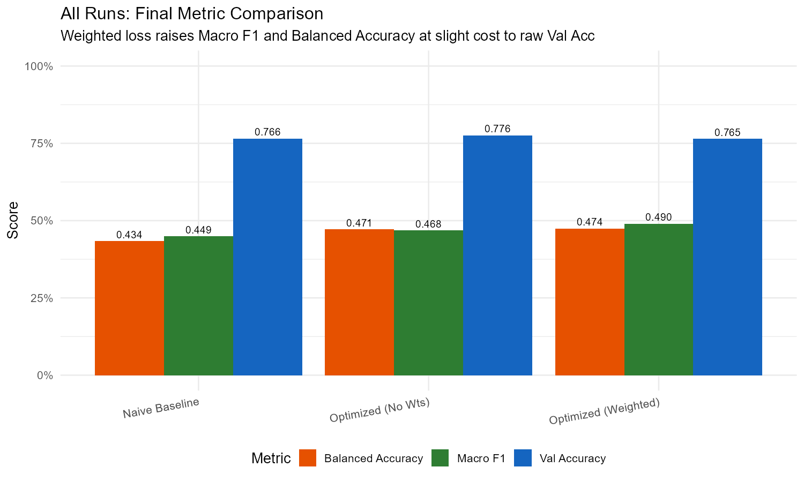
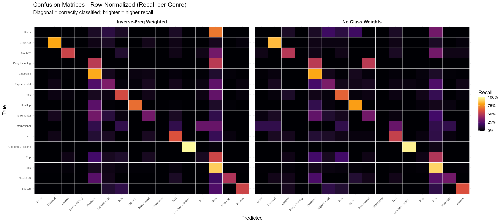
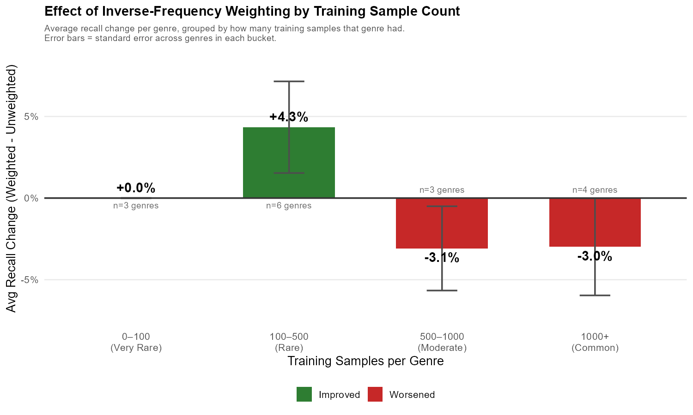

## Abstract

In this project, we develop a deep learning system for classifying music genres from raw audio in the Free Music Archive (FMA) Medium dataset, a 16-genre, ~17,000-track corpus with severe class imbalance (the two majority genres account for roughly two-thirds of all tracks). To capture both spectral characteristics and temporal structure such as rhythm, tempo, and melodic progression, we implement a Convolutional Recurrent Neural Network (CRNN) that combines a stack of convolutional layers for local feature extraction with a bidirectional recurrent layer for modeling sequential dependencies across the time axis of a log-mel spectrogram.

The project emphasizes both predictive performance and per-class error analysis under class imbalance. We conduct a three-phase hyperparameter search over learning rate, batch size, and recurrent hidden size, and we compare an unweighted cross-entropy objective against an inverse-frequency weighted variant to study how loss reweighting affects minority-class performance. Beyond overall accuracy, we report macro-F1, balanced accuracy, per-class precision and recall, and confusion matrices, in order to characterize how the model behaves on common and rare genres alike. Overall, this work aims to build a strong CRNN baseline for genre classification while offering insight into the effect of design choices in deep learning systems applied to real-world, imbalanced audio data.

## Introduction

Automatically identifying the genre of a music track presents a challenge in machine learning due to the complex, time-dependent nature of musical structure. Music is not defined by isolated acoustic features, but by patterns that unfold over time, such as rhythm, harmony, instrumentation, and dynamics. These patterns interact across multiple temporal scales, making it difficult for models that rely solely on local or static representations to capture the qualities that distinguish musical styles.

This challenge is further compounded by the variability inherent in music genres. Tracks within the same genre can differ significantly in tempo, timbre, and arrangement, while different genres may share similar short-term spectral characteristics. As a result, approaches that focus only on momentary acoustic information often struggle to align with the way humans recognize and categorize music.

The Free Music Archive (FMA) Medium dataset adds a second difficulty on top of this representational challenge: severe class imbalance. Of the 16 top-level genres in the corpus, two (Rock and Electronic) account for the majority of all tracks, while several others (e.g., International, Easy Listening, Blues) are represented by only a handful of examples. A classifier trained naively on this distribution can achieve high overall accuracy while still failing entirely on minority genres, which makes overall accuracy a misleading metric in isolation.

The goal of this project is to develop a deep learning model that captures the temporal structure of music while also performing meaningfully on under-represented genres. By designing a system that integrates both local spectral detail and longer-term temporal context, and by evaluating it with imbalance-aware metrics in addition to accuracy, we aim to characterize both the strengths of the CRNN approach and the limits imposed by the underlying data distribution.

## Methodology

### Dataset

We use the FMA Medium release: 25,000 Creative Commons-licensed MP3 tracks distributed across 16 top-level genres. After discarding 12 corrupt or unreadable files, our pipeline successfully processed 16,988 tracks. The class distribution is heavily skewed: Rock (6,099 tracks) and Electronic (5,312 tracks) together comprise roughly 67% of the data, while Easy Listening (21), International (18), and Blues (74) sit at the opposite end of the spectrum. Genre labels are taken from the `track_genre_top` field of the official FMA `tracks.csv` metadata file, and a fixed integer label map is generated and persisted alongside the feature tensors to ensure consistent class indexing across training and evaluation.

### Data Representation

Each MP3 is decoded to mono PCM at 22,050 Hz and trimmed or zero-padded to a fixed 30-second duration. From the resulting waveform we compute a log-mel spectrogram with 128 mel bands, a 2,048-sample FFT window, and a 512-sample hop, yielding a fixed-shape input tensor of (1, 128, 1292) per track. Each spectrogram is z-score normalized per sample (mean and standard deviation computed over its own time–frequency grid) so that the model is exposed to amplitude-invariant inputs.

The full preprocessing pipeline is implemented in Python using `librosa` for spectrogram computation and `concurrent.futures.ProcessPoolExecutor` for parallelization. Running with 16 worker processes on a Ryzen 9950X3D, the full corpus was processed in 15.4 minutes with a peak memory footprint of 10.9 GB. The resulting feature tensor `X.npy` (shape `(16988, 1, 128, 1292)`, float32, ~16 GB on disk) and label tensor `y.npy` are stored in NumPy's binary format and loaded at training time via `np.load(..., mmap_mode="r")`, which avoids materializing the entire dataset in RAM and allows the training loop to stream batches directly from disk.

### Model Architecture

The model is a Convolutional Recurrent Neural Network (CRNN) operating on the log-mel spectrogram input. The convolutional front-end consists of three stacked Conv2D blocks, each followed by batch normalization, a ReLU nonlinearity, and 2×2 max pooling. These layers progressively reduce the frequency and time resolution of the feature map while expanding the channel dimension, producing a sequence of feature vectors indexed along the time axis. They are responsible for learning short-term spectral patterns – onsets, timbral textures, and local harmonic structure – that are useful for genre discrimination but do not on their own capture longer-term temporal dependencies.

The output of the convolutional stack is reshaped into a time-major sequence and passed to a bidirectional Gated Recurrent Unit (GRU). Operating in both forward and backward directions, the GRU aggregates information across the temporal dimension and produces a sequence of context-aware hidden states; the final hidden states from both directions are concatenated to form a fixed-length summary of the entire 30-second clip. This summary is fed through a fully connected classification head with dropout (p = 0.3) and a 16-way softmax output. The recurrent hidden size is treated as a tunable hyperparameter (see Experimental Setup); we search over {64, 128, 256, 512}.

This division of labor between convolutional and recurrent components allows the model to leverage the strengths of both approaches: efficient local pattern recognition and explicit temporal modeling. The resulting architecture is well-suited to learning genre-defining patterns that emerge across multiple time scales. Figure 1 shows the full data flow through the network along with the tensor shape at each stage.

## Experimental Setup

To evaluate the effectiveness of the proposed approach, we adopt a controlled experimental framework designed to isolate the impact of architectural and training choices on music genre classification performance. The experimental setup emphasizes fair comparison, reproducibility, and systematic exploration of model behavior. All experiments are run on a single workstation (Ryzen 9950X3D, RTX 5090) using PyTorch, with the Adam optimizer and a fixed weight decay of 0.0001 unless otherwise noted.

### Data Splitting and Evaluation Protocol

The 16,988 preprocessed tracks are partitioned into training and validation subsets via an 80/20 random split with a fixed seed, yielding 13,590 training and 3,398 validation tracks. The split is uniform rather than stratified by genre, which means the rarest classes are represented in the validation set by only a handful of examples (e.g., 2 for Easy Listening, 7 for International); per-class metrics for these very low-support classes should accordingly be interpreted with caution. The training set is used to learn model parameters, while the validation set supports both model selection during hyperparameter tuning and reporting of in-distribution metrics.

To probe generalization beyond the training distribution, we additionally evaluate the final models on a held-out test set drawn from the FMA Large release. FMA Medium is a strict subset of FMA Large, so the "Large-only" slice (tracks present in Large but not in Medium) provides genuinely unseen audio under the same source, encoding, and labeling conventions as training data. We sample up to 100 tracks per genre from this slice with a fixed seed, capped at the actual availability of each genre, producing a test manifest of 1,220 tracks across the 16 top-level genres. Compared to the heavily skewed training distribution, this test set is much closer to balanced and therefore provides a more honest signal of per-class generalization. All models compared in this work are trained and evaluated on identical splits to enable direct comparison.

### Hyperparameter Search

Model performance is sensitive to architectural and optimization hyperparameters, and careful tuning is essential for a fair evaluation. We conduct a three-phase, coordinate-descent style search over the parameters that prior experimentation flagged as most influential: learning rate, mini-batch size, and the recurrent hidden size. In Phase 1, learning rate is varied over {0.0001, 0.0003, 0.001, 0.003, 0.01} with batch size and hidden size held at sensible defaults. In Phase 2, the best learning rate is fixed and batch size is varied over {32, 64, 128}. In Phase 3, the best learning rate and batch size are fixed and the recurrent hidden size is varied over {64, 128, 256, 512}. Each configuration is trained for 25 epochs and scored by best validation accuracy.

Several other dimensions that a hyperparameter search could in principle vary – the optimizer (Adam), the dropout rate (0.3 in the FC head), the weight decay coefficient (0.0001), and the convolutional architecture itself – are fixed at standard values throughout in order to keep the search tractable within our compute budget and to isolate the effect of the three axes above.

Rather than optimizing for a single metric in isolation, the search process considers training stability and generalization behavior alongside accuracy. This approach helps identify configurations that balance performance with robustness and reduces the risk of overfitting to the training data. The final configuration selected from this search is then re-trained for 50 epochs and serves as the basis for the class-weighting comparison described below.

### Class Weighting Comparison

Because the FMA Medium label distribution is heavily imbalanced, we additionally compare two training objectives at the tuned configuration: a standard unweighted cross-entropy loss, and an inverse-frequency weighted cross-entropy in which each class's contribution to the loss is scaled by the reciprocal of its training-set support. Both runs use identical optimization settings and training budgets, so any differences in their final metrics are attributable to the loss function alone.

### Metrics and Analysis

Effectiveness is measured along several axes rather than by overall accuracy alone, which is misleading under heavy class imbalance. We report overall classification accuracy on the validation set together with macro-F1 and balanced accuracy, which weight all 16 genres equally regardless of their training-set frequency. Per-class precision, recall, and F1 scores, as well as row-normalized confusion matrices, are used to characterize how errors are distributed across genres and to quantify the trade-offs introduced by class weighting. Training and validation loss curves are also tracked across epochs to examine convergence behavior, learning stability, and the onset of overfitting.

Through this experimental design, we aim to demonstrate that explicitly modeling temporal dependencies leads to effective genre classification performance and stable learning behavior, while also surfacing the limits of what such a model can learn from a highly imbalanced label distribution.

## Results

We present our findings in four stages that mirror the experimental progression: a naive baseline that motivates tuning, the three-phase hyperparameter search, the optimized final run, and the inverse-frequency weighting comparison. All metrics are reported on the 3,398-track validation set described above.

**Naive Baseline.** Our initial training run used straightforward defaults (lr=0.001, batch size 128, rnn_hidden=128, 50 epochs, unweighted cross-entropy). The model reached a best validation accuracy of 76.57% at epoch 16, after which training accuracy continued climbing toward 99% while validation accuracy plateaued and slowly declined – a textbook overfitting pattern (Figure 2). The macro-F1 (0.449) and balanced accuracy (0.434) reveal that overall accuracy was being driven almost entirely by the two majority genres; the model had effectively learned to specialize on Rock and Electronic while neglecting the rest. This established two priorities for tuning: regularization to close the train/val gap, and an evaluation perspective that weights all 16 genres equally so that minority-class behavior is visible.

**Hyperparameter Search.** The three-phase coordinate-descent search (25 epochs per configuration) clarified the relative influence of each parameter (Figure 3). Learning rate was by far the dominant factor: 0.0003 reached 77.13% best validation accuracy with stable training curves, while 0.01 collapsed to 71.60% with visibly unstable loss trajectories. Batch size had a marginal effect within {32, 64, 128} – a range of only 0.8 percentage points in best validation accuracy – though larger batches converged in slightly fewer epochs. Recurrent hidden size produced a small but monotonic improvement, from 76.81% at hidden size 64 to 77.60% at hidden size 512. Based on these results we selected lr=0.0003, batch size 64, and rnn_hidden=512 for the final runs.

**Optimized Run.** Trained for 50 epochs with the tuned configuration and an unweighted cross-entropy objective, the model reached a best validation accuracy of 77.58% at epoch 46. The macro-F1 of 0.468 and balanced accuracy of 0.471 mark a meaningful improvement over the naive baseline on the imbalance-aware metrics, even though overall accuracy moved by only one percentage point (Figure 4). Training was noticeably more stable than the naive run: the train/val gap was smaller, and the validation curve continued to improve slowly through the final epochs rather than reversing.

Per-class behavior reveals what the headline accuracy conceals (Figure 5). The unweighted model never predicts the correct label for *any* sample of Blues, Easy Listening, or International – all three classes finish with zero diagonal entries in the confusion matrix and an F1 of exactly 0.0. F1 scores above 0.75 are achieved for Classical, Electronic, Hip-Hop, Old-Time/Historic, and Rock – all genres with substantial training support. These three failure cases share an obvious property – they are the three smallest classes in the validation set (16, 2, and 7 samples respectively), and they are also the three smallest in the training set. The confusion matrix also shows that the dominant failure mode for many mid-frequency genres is misclassification as Rock or Electronic, reflecting the prior the network has learned from the training distribution.

**Inverse-Frequency Weighted Loss.** Replacing the unweighted cross-entropy with an inverse-frequency weighted variant at the same configuration produced a clear and informative trade-off. Overall validation accuracy fell from 76.66% to 75.46%, but macro-F1 rose from 0.468 to 0.490 and balanced accuracy from 0.471 to 0.474. The gains were not uniform across genres – they were concentrated in mid-frequency classes that had enough training support to actually benefit from upweighting. Country F1 rose from 0.47 to 0.58, Soul-RnB from 0.36 to 0.54, and Spoken from 0.52 to 0.59. The Spoken case is illustrative of the underlying mechanism: weighting raised precision from 46.4% to 63.2% while recall dropped slightly from 59.1% to 54.5%, indicating that the model became more selective about its positive predictions for that class rather than simply biasing toward minority labels.

Crucially, weighting did not rescue the rarest classes. Bucketed by training-set size (Figure 6), genres with fewer than 100 training samples saw essentially no average improvement, while genres in the 100-1000 sample range improved the most. This suggests that loss reweighting can correct for distributional skew when there are enough examples to learn from, but it cannot manufacture signal where samples are simply too sparse. Rescuing the tail of the distribution would require data-level interventions – oversampling, audio augmentation, or rolling the rarest genres up into broader parent categories in the FMA taxonomy.

**Out-of-Distribution Test on FMA Large.** To probe how well the in-distribution metrics carry over to unseen audio, we ran both final models on a held-out test set of tracks present in FMA Large but absent from FMA Medium. Due to a rate limit on the per-file download API used to fetch the test set, the results reported here cover a 576-track subset of the planned 1,220-track manifest; the remaining tracks are being fetched in a follow-up pass and will tighten confidence intervals, but are not expected to change the qualitative findings below. Per-class support in the evaluated subset is much closer to balanced than the training distribution: Rock and Electronic each contribute roughly 9% of the test set rather than ~36% and ~31% of training.

The drop relative to in-distribution validation is large. The unweighted model reaches 42.4% accuracy, macro-F1 of 0.321, and balanced accuracy of 0.354, against 76.7%, 0.468, and 0.471 respectively on the validation set. The inverse-frequency weighted model lands at 41.0% accuracy, macro-F1 0.336, and balanced accuracy 0.356. As on the validation set, weighting trades a small amount of overall accuracy for a modest macro-F1 gain, and the trade-off goes in the same direction here.

The per-class breakdown reveals that this is not a simple loss of genre-level features. Rock recall, for instance, stays high on the test set (0.81 unweighted, 0.77 weighted), meaning the model still correctly identifies most genuine Rock tracks. What collapses is Rock *precision*: the unweighted model predicts Rock for 159 tracks on the test set, of which only 43 are actually Rock, driving precision down to 0.27 from 0.83 on validation. The 116 spurious Rock predictions are spread across Jazz (19), Spoken (18), Folk (15), Pop (15), Blues (15), Instrumental (9), and several smaller groups. Electronic shows the same pattern at smaller scale: recall 0.66, precision 0.33. Meanwhile, several genres with distinctive acoustic signatures – Old-Time / Historic (F1 0.94), Classical (F1 0.74 on the weighted model), and Hip-Hop (F1 0.66 to 0.77) – generalize almost perfectly to the held-out set.

We interpret this as overfitting to the training-set *prior* rather than to genre-level features. During training, Rock and Electronic together account for roughly two-thirds of the data, so a "predict Rock or Electronic when uncertain" default is statistically rewarded on both training and same-distribution validation. On the more balanced FMA Large test set, that prior is wrong far more often than it is right, and the cost shows up as precision collapse on exactly those two majority classes. Inverse-frequency weighting partially corrects the prior, producing small but real F1 gains on Country, Soul-RnB, and International on the test set, but cannot fully undo a bias the model has been trained for 50 epochs to internalize. This finding also strengthens the case made in earlier sections for evaluating with macro-F1 and balanced accuracy alongside raw accuracy: the validation accuracy of ~77% is genuinely an *upper bound* on what the model can be expected to deliver on unseen music whose label distribution is less skewed.

## Conclusion

This work built and evaluated a Convolutional Recurrent Neural Network for music genre classification on the FMA Medium dataset, with an end-to-end pipeline covering preprocessing, hyperparameter search, weighted-loss comparison, and an out-of-distribution test on FMA Large. The tuned configuration (learning rate 0.0003, batch size 64, recurrent hidden size 512) reaches a best validation accuracy of 77.6%, with macro-F1 of 0.468 and balanced accuracy of 0.471. Replacing the unweighted cross-entropy with an inverse-frequency weighted variant trades approximately one percentage point of overall accuracy for a 0.02 gain in macro-F1, concentrated in mid-frequency genres such as Country, Soul-RnB, and Spoken.

Three findings stand out. First, raw accuracy is a misleading metric on this dataset: the two majority genres (Rock and Electronic, together ~67% of the corpus) carry most of the headline number, while three rare genres (Blues, Easy Listening, International) finish with an F1 of exactly 0.0 in both unweighted and weighted runs. Macro-F1 and balanced accuracy give a more honest picture of generalization across the 16-way label space. Second, loss reweighting is a partial but real fix for class imbalance: it helps genres with enough training support to learn from (roughly the 100 to 1,000 sample range), but it cannot manufacture signal where training examples are simply too sparse. Recovering the tail of the distribution would require data-level interventions – oversampling, audio augmentation, or rolling the rarest genres up into broader parent categories in the FMA taxonomy. Third, and most surprisingly, the out-of-distribution test on FMA Large reveals that the model learned a strong *prior* over the training-set label distribution in addition to genre-level acoustic features: Rock and Electronic recall remain high on unseen tracks, but precision collapses on the more balanced held-out set because the model defaults to those labels when uncertain.

Several limitations qualify these results. The validation split is uniform rather than stratified, so per-class metrics for the rarest genres rest on single-digit sample counts. The hyperparameter search varied only learning rate, batch size, and recurrent hidden size; optimizer, dropout, weight decay, and the convolutional architecture itself were held fixed. The OOD test set, by design, draws from the same FMA corpus as training and so does not test generalization to genuinely different audio sources (radio rips, commercial releases, user uploads). Worthwhile next steps include retraining with audio-level data augmentation (pitch shifting, time stretching, additive noise) and stratified sampling, evaluating on a label-mapped subset of GTZAN or other independently sourced datasets, and exploring whether a more aggressive form of class balancing (e.g., focal loss, oversampling at the data loader, or merging genres up the FMA hierarchy) can close more of the in-distribution-to-OOD gap than inverse-frequency weighting alone.
												

